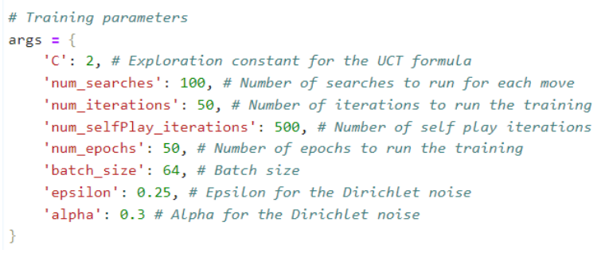

# Attax for Go and Attax board games
Assignment of the course of Laboratory of Artificial Intelligence and Data Science (3rd year, 1st semester)

## A little context
### Code Structure:
* Consists of 10 notebooks, 5 referring to each game.
* Comprises 2 notebooks related to the implementation of the agent for the game Attax.

### Characteristics of each notebook:
* Test Notebook (Attax_Test.ipynb and Go_Attax.ipynb):
  * This is where all tests such as:
    * Playing in different modes:
      * Player vs Player;
      * Player vs MCTS;
      * Player vs MCTS + CNN (or MCTS + RNN);
    * Neural network testing (CNN and RNN);
    * AlphaZero training.

### Game Class (AttaxGame.ipynb and GoGame.ipynb):
The games are defined in generic classes, meaning they have no dependency on either the player or the state of the board.

### Neural Networks (NeuralNetwork_Attax.ipynb and NeuralNetwork_Go.ipynb):
* Two neural networks were defined in classes, with resNet architecture for each game: Convolutional and Recurrent.
* It was intended to compare both in order to choose the one with better performance, based on the loss of each.
* These were initialized with 4 resBlocks and 64 hidden layers, also using Adam as the optimizer, 0.001 as the learning rate, and 0.0001 as weight decay.

### Monte Carlo Tree Search (MCTS_Attax.ipynb and MCTS_Go.ipynb):
* Similarly, classes related to each game were defined.

### AlphaZero (AlphaZero_Attax.ipynb and AlphaZero_Go.ipynb):
* In these notebooks, the AlphaZero class was defined where training and learning of the model are carried out through various sequences of games played against "itself".
* In order to be more efficient, a condition was placed to check the availability of the GPU.
* A validation technique with early stopping was implemented to prevent overfitting.
* The parameters used for training the models were the following:
  

### The main components of the AlphaZeroAgent class include:

* Initialization;
* Model Load: Depending on the dimensions of the game (4x4, 5x5, or 6x6), it loads the best-trained model to evaluate game states and generate likely moves;
* Move Making: Decision-making of the most promising move and game simulation, using MCTS guided by CNN;
* Response Handling: Processing responses from the game server, including updating the game state based on the opponent's moves.
